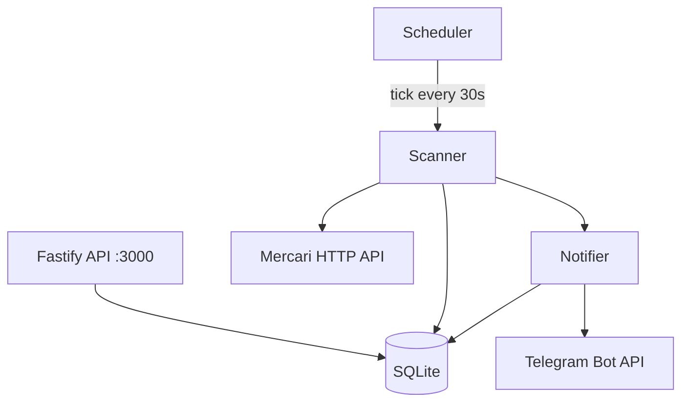

# Mercari JP Bot — Architecture Overview

## Goals
- Monitor Mercari JP listings by keyword filters.
- Send near-real-time Telegram alerts for new or cheaper items.
- Persist operational state in SQLite.
- Run as a single unified process (API + scheduler + scraper + notifier).

## Runtime Components

All components run in a single Node.js process (`apps/unified`). There are no queues or separate workers — the scheduler triggers scans directly, and the scanner invokes the notifier inline.

## Data Flow

1. **Scheduler** ticks every `SCHEDULER_TICK_SECONDS` (default 30s), checks which keywords are due for scanning.
2. **Scanner** calls the Mercari HTTP API (with DPoP authentication), deduplicates results via `seen_listings`, persists new/updated listings, and passes them to the notifier.
3. **Notifier** sends Telegram messages with rate limiting (`TELEGRAM_MIN_DELAY_MS`) and exponential backoff on failure.
4. **Daily summary** is scheduled at `DAILY_SUMMARY_TIME` and reports per-keyword listing counts.

## Data Model

Primary tables (SQLite via Prisma):
- `keywords` — search terms, filters, scan intervals
- `listings` — scraped Mercari items
- `seen_listings` — dedup hashes
- `scan_runs` — audit log per scan
- `notifications` — Telegram message tracking
- `daily_keyword_counts` — stats for daily summaries

## Reliability Behaviors
- Notifier retries with exponential backoff (configurable via `TELEGRAM_MAX_RETRIES`, `TELEGRAM_BACKOFF_FACTOR`).
- Telegram provider failures do not crash the process.
- Photo send failures fall back to text-only messages.
- Dedupe checks persist in `seen_listings` to survive restarts.
- Structured JSON logs (Pino) and Prometheus metrics emitted.

## Security Baseline
- Admin API protected by `ADMIN_TOKEN` + `ADMIN_ALLOWED_IPS`.
- Secrets loaded from environment only.
- Telegram token redacted in logs.

## Config Source of Truth
- **`config.yaml`** is the source of truth for keyword definitions. On startup (and on `POST /v1/config/reload`), keywords are synced from YAML into the `keywords` DB table.
- Keywords present in YAML are enabled; keywords removed from YAML are disabled (not deleted, to preserve FK data).
- Schedule settings (`DAILY_SUMMARY_TIME`, `DISPLAY_TIMEZONE`) are read from environment variables.
