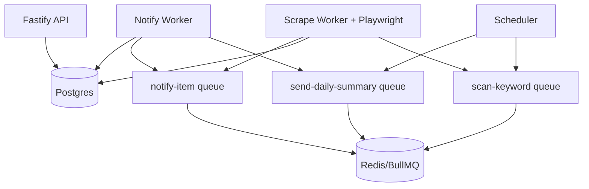

# Mercari JP Bot - Node Architecture Overview

## Goals
- Monitor Mercari JP listings by keyword filters.
- Send near-real-time Telegram alerts for new or cheaper items.
- Persist operational state in Postgres.
- Isolate failures with queue-driven workers.

## Runtime Components

## Queue Contracts
- `scan-keyword`: `{ keywordId, triggeredBy, runId? }`
- `notify-item`: `{ itemId, keywordId, channel }`
- `send-daily-summary`: `{ dateUtc, timezone, channel }`
- `retry-failed-notification`: `{ notificationId, reasonCode }`

## Data Model
Primary tables:
- `keywords`
- `listings`
- `seen_listings`
- `scan_runs`
- `notifications`
- `daily_keyword_counts`
- `system_config`

## Reliability Behaviors
- Per-worker retries with exponential backoff.
- Telegram provider failures do not crash workers.
- Photo send failures fall back to text.
- Dedupe checks persist in `seen_listings`.
- Structured logs and Prometheus metrics are emitted per process.

## Security Baseline
- Admin API protected by token + IP allowlist.
- Secrets loaded from environment only.
- Telegram token redaction in logs.

## Config Source of Truth
- Runtime keyword/filter/schedule config is stored in Postgres.
- Legacy `config.yaml` is import-only (`pnpm run db:import-legacy-config`).
